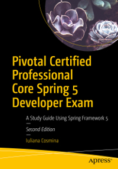

= Apress Source Code

This repository accompanies https://www.apress.com/us/book/9781484251355[Pivotal Certified Professional Spring Developer Exam, 2nd Edition] by Iuliana Cosmina (Apress, 2019).

== Building and Deploying
This project has been configured to use gradle wrapper considering any future updates.
All the gradle commands mentioned, can be executed using gradle wrapper.

For example - build can be done as `./gradlew build`

This is a Gradle multi-module project. The *-practice projects, have tests and pieces left unimplemented so building the full project using:
----
gradle build
----
will fail.

To build the full project and skipping tests, build from the root (`pivotal-certified-pro-spring-dev-exam-02`) directory:
----
gradle build -x test
----

To use cached builds execute:
----
gradle --build-cache clean build assemble
----

To build the project  and scan your build execute:
----
gradle clean build --scan
----
Just keep in mind, the project is quite big and when displaying the results, you browser might be slow.

German unicode characters here: http://javawiki.sowas.com/doku.php?id=java:unicode

== Observation

The *ojdbc* artifact is now available in Maven public repository, so building this project should work out of the box.

== Releases

Release v2.0 corresponds to the code in the published book, without corrections or updates.

== Contributions

See the file Contributing.md for more information on how you can contribute to this repository.

== Upgrades

Due to R2DBC being experimental the build published together with the book is currently deprecated.
This version contains an upgraded version of the project, with all Spring libraries upgraded to the most recent stable versions.
The R2DBC project is now fully functional as well, the tests pass when run as part of the Gradle build.
The project is build with JDK 13 sucessfully.
Gradle version has been upgraded to use gradle 6.X

If the returned result is a collection, the
