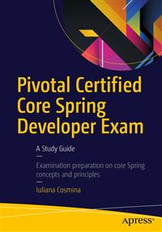

= Apress Source Code - Pet Sitter Project

This repository accompanies https://www.apress.com/us/book/9781484208120[Pivotal Certified Professional Spring Developer Exam, 2nd Edition] by Iuliana Cosmina (Apress, 2019).

== Building and Deploying
This is a Gradle multi-module project. The *-practice projects, have tests and pieces left unimplemented so building the full project using:
----
gradle build
----
will fail.

To build the full project and skipping tests, build from the root (`pet-sitter`) directory:
----
gradle build -x test
----

To build the project and ignore failed tests so you can get your full build status with Gradle Receipt, build from the root (`pet-sitter`) directory, using the following command:
----
gradle build -Dscan --continue
----
Just keep in mind, the project is quite big and when displaying the results, you browser might be slow.

German unicode characters here: http://javawiki.sowas.com/doku.php?id=java:unicode

== Observation

The ojdbc artifact is not available in Maven public repository.
There are two possible solutions:

* download it from the Official Oracle site and store it in the ~/.m2/repository/.. where Gradle is expecting to find it.
* in build.gradle replace this line:
----
ojdbc             : "com.oracle:ojdbc7:12.1.0.2",
----
with  this line:
----
ojdbc             : "com.github.noraui:ojdbc7:12.1.0.2.0"
----

I'm not sure how long the artifact will be available there (https://mvnrepository.com/artifact/com.github.noraui/ojdbc7/12.1.0.2),
because Oracle licensing might prevent people from sharing their artifacts on public servers, so for long term use, the first solution is recommended.

== Releases

Release v2.0 corresponds to the code in the published book, without corrections or updates.

== Contributions

See the file Contributing.md for more information on how you can contribute to this repository.
